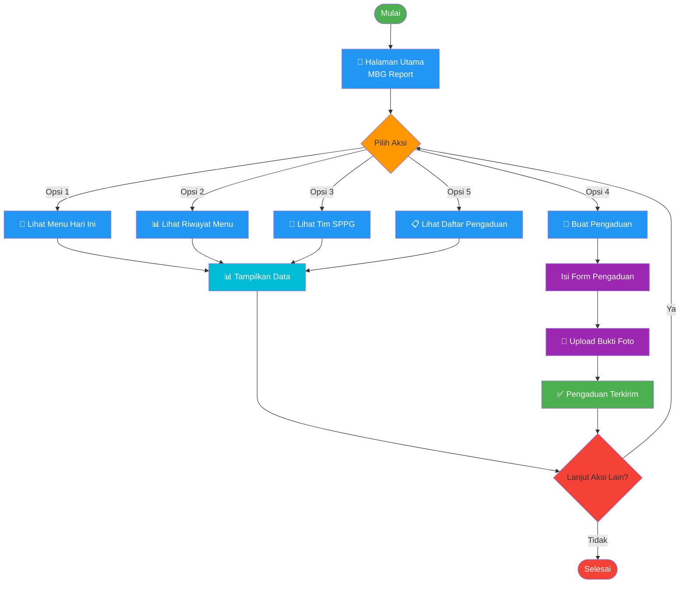
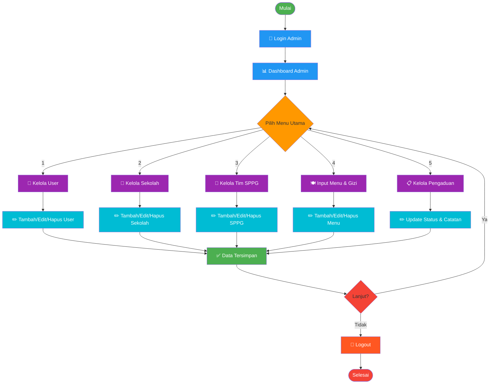
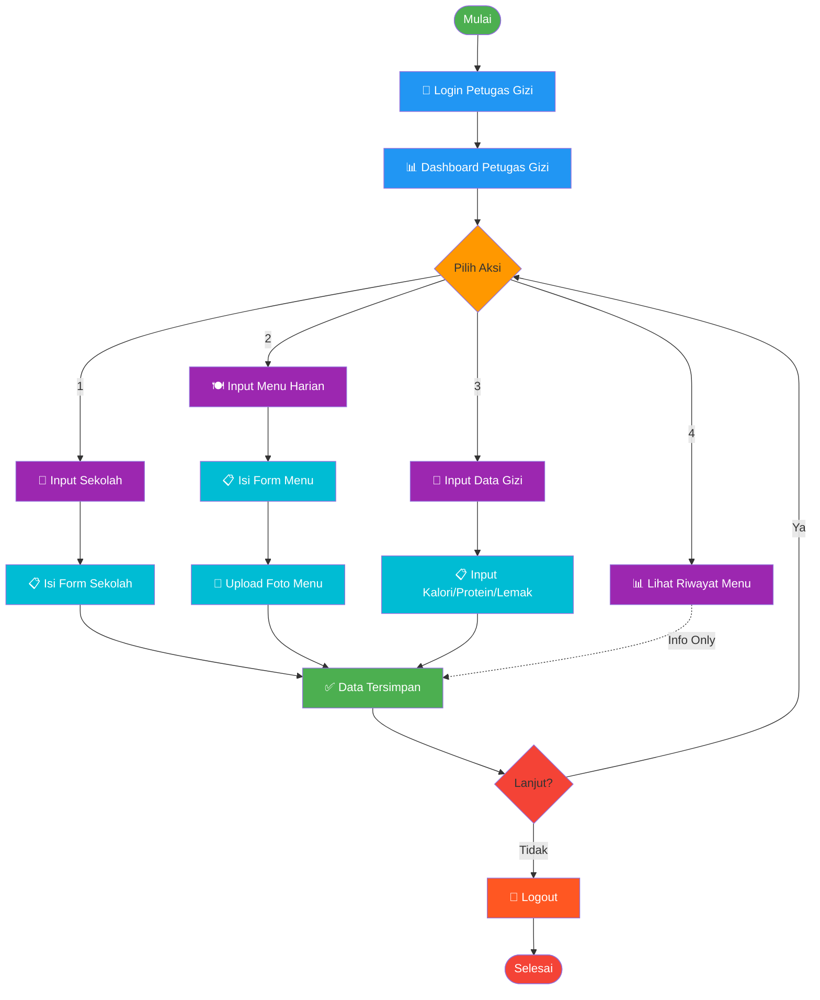
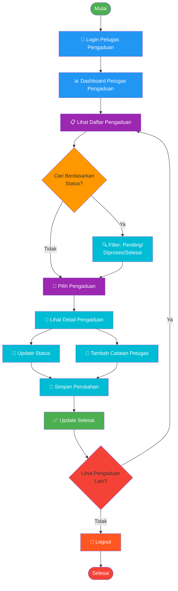

# Mermaid Flowchart Diagrams - MBG Report System

Berikut adalah flowchart dalam format Mermaid yang dapat dilihat di GitHub dan platform lain yang mendukung Mermaid.

---

## 1. ALUR KERJA USER (Publik)

---

## 2. ALUR KERJA ADMIN

---

## 3. ALUR KERJA PETUGAS GIZI

---

## 4. ALUR KERJA PETUGAS PENGADUAN

---

## Referensi Penggunaan Fitur

### User (Publik)
- Akses bebas tanpa login
- 5 menu utama untuk browsing informasi
- Dapat membuat laporan pengaduan dengan foto bukti

### Admin
- Full access ke semua fitur
- Manajemen user, sekolah, tim SPPG
- Input menu & data gizi
- Overview semua pengaduan

### Petugas Gizi
- Input data sekolah yang berpartisipasi
- Input menu harian dengan foto
- Input data nutrisi (kalori, protein, dll)
- Lihat riwayat menu yang telah diinput

### Petugas Pengaduan
- Melihat semua pengaduan masuk
- Filter berdasarkan status (Pending, Diproses, Selesai)
- Update status pengaduan
- Tambah catatan tindak lanjut
- Tracking pengaduan dari awal hingga selesai

---

## Dokumen Pendukung

- **FLOWCHART_README.md** - Dokumentasi lengkap flowchart
- **flowchart_user.xml** - XML draw.io untuk User
- **flowchart_admin.xml** - XML draw.io untuk Admin
- **flowchart_petugas_gizi.xml** - XML draw.io untuk Petugas Gizi
- **flowchart_petugas_pengaduan.xml** - XML draw.io untuk Petugas Pengaduan
- **FLOWCHART_MERMAID.md** - Diagram Mermaid (file ini)

---

**Created:** 7 April 2026  
**Version:** 1.0  
**Format:** Mermaid Diagram Syntax
